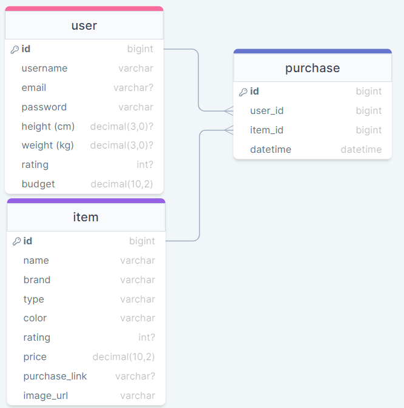

# Style Fit : Like My Fit?

## Overview

Style Fit is a personalized fashion recommendation app designed to make fashion choices easy. Look towards others for inspiration or share your favorite outfits!

### `npm start`
Runs the app.
Open [http://localhost:3000](http://localhost:3000) to view it in your browser.
Also deployed on [style-fit.netlify.app/](https://style-fit.netlify.app/)

### Problem

Finding the perfect outfit that suits your personal needs involves considerations of body type, style, and budget. Style Fit simplifies this process by connecting users with similar tastes, making it easier to shop for outfits they will love.

Market Research shows that similar fashion apps primarily focus on connecting customers with designers. While social media apps (Twitter, Facebook, etc) can be used to connect users based on fashion interests, they lack functionality to allow users to discover new outfits easily.

Style Fit aims to connect provide users with a more casual experience, connecting them with other people with similar body styles and fashion tastes, growing a healthy community.

### User Profile

-   **Primary Users:**
    -   Individuals seeking guidance in finding clothes that match their unique style but are unsure where to start.
    -   Fashion enthusiasts eager to share their style and help others in their fashion journey.

### Features

**User Profiles:**

-   Users can create profiles by inputting their height, weight, and body style.

**Discover Similar Styles:**

-   Users can browse profiles of others to find users with similar body types and styles.
-   View outfits shared by community members for inspiration.

**Budget-Friendly Recommendations:**

-   Receive curated fashion suggestions based on personal style preferences and specified budget.

**Outfit Sharing:**

-   Users can upload pictures of their outfits to share with the community.
-   Automatically provides links to purchase the item or the entire outfit directly if bought through the app link.

## Implementation

#### Tech Stack

1. **Frontend:**
    - React
    - react-router
    - axios
    - typescript
2. **Backend:**
    - Node JS
    - typescript
    - Express
    - MySQL
    - knex
    - bycrypt
    - jwt
    - openai (visionai)

#### APIs

-   External APIs:
    -   openai: openai's vision api allows users to upload pictures of their entire outfit, saving time and effort on having to upload each clothing individually.
    -   Once image is uploaded, ai will recognize each article of clothing and give it a name (e.g. Pink Polka-dotted Floral Dress)

#### Sitemap

##### Home Page:

-   Landing page displaying featured and trending users with similar styles.
-   Navigation to other sections of the app.

#### Register Page

#### Login Page

##### User Profile:

-   Displaying user details, including height, weight, and style preferences.
-   Edit profile option.
-   Upload outfits option

##### Discover Styles:

-   List of users with similar body types.
-   Clicking on a user leads to their profile and shared outfits.

##### Outfit Details:

-   Detailed view of a user's outfit, including individual items and purchase links.
-   Option to save the outfit for later.

#### Data



### Endpoints

**GET /login/**

-   Get user profile

Parameters:

-   email, password

Response:

```
{
   "token" : {auth token}
}
```

**POST /signup**

-   Create user profile

Parameters:

-   email, username, password

Response:

```
{
   "token" : {auth token}
}
```

**GET /user**
-   Gets all users

Parameters:

-   auth token(optional)

Response:

```
{
   user[] (sorted if auth token)
}
```

**GET /user/:userId**
-   Gets one user

Parameters:

-   userId

Response:

```
{
   user
}
```

**GET /user/userId/outfits**
-   Gets one user all outfits

Parameters:

-   userId

Response:

```
{
   user outfit[]
}
```

**GET/PUT /profile**
-   Gets / edits profile of logged in user

Parameters:

-   authtoken
-   profile data (for PUT)

Response:

```
{
   profile data
}
```

**GET/POST/DELETE /profile/outfits**
-   Gets / creates / deletes outfits logged in user

Parameters:

-   authtoken
-   outfit picture link (for POST)
-   outfit id (for DELETE)
  
Response:

```
{
   outfit data
}
```

**GET /profile/favorite**
-   Gets saved outfits of logged in user

Parameters:

-   authtoken

Response:

```
{
   outfit[]
}
```

**POST / DELETE /profile/favorite/:outfitId**
-   Creates / deletes saved outfits of logged in user

Parameters:

-   authtoken
-   outfit Id

Response:

```
{
   outfit details
}
```

**GET /clothing/:outfitId**
-   Gets clothing information of one outfit

Parameters:

-   outfit Id

Response:

```
{
   clothing[]
}
```

#### Auth

**Middleware:**

-   Express.js middleware
-   Before processing requests to protected endpoints (e.g., creating outfits, rating users), the server will verify the validity of the request body.
-   Password is hashed and stored via bcrypt npm package. Random salt = 10.
-   User Session will be stored in local storage, and removed on logout. It will be used to render the app accordingly.

# Roadmap

## Sprint 1: Front-end Setup and User Profile

-   Set up a new React project.
-   Create page for users to set up and edit profiles.
-   Design UI components for profile data input.

## Sprint 2: Front-end Outfit Upload and Display

-   Implement UI components for users to upload outfits.
-   Design the form for outfit details.
-   Create pages to display uploaded outfits.
-   Fetch and render mock outfit data.

## Sprint 3: Back-end Setup and Integration

-   Initialize the back-end server using Node.js and Express.
-   Set up basic routes for outfit upload and retrieval.
-   Connect the React front-end with the back-end.
-   Ensure outfit upload and display functionalities are working with mock data

## Nice-to-haves

### Ratings and Tags :

-   Implement basic functionality for users to rate and tag others.
-   Display ratings and tags on user profiles.

### Basic Recommendation System :

-   Recommendation system based on user preferences, tags, and likes.

### Notification System :

-   Basic notification system for new items, followed users, etc.
